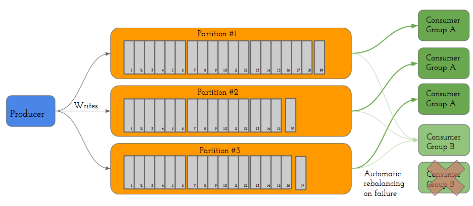

Apache Kafka

# Présentation 

Apache Kafka est une plateforme de messagerie distribuée. Utilisant un mode d'échange de type publish/subscribe. Les données échangées sont persistantes. Kafka a une capacité à scale horizontalement du fait de sa distribution à tous les niveaux. De plus il supporte des débits élevés de publication comme de lecture des messages. 

# Mode d’échange

Kafka fonctionne en publish subscribe.  Les Producteurs publient des messages sur des topics et les consommateurs lisent les messages sur ce dernier. 

Mécanisme zero copy, qui envoie directement les données du disque à la socket.

# Topics 

Un topic est constitué de plusieurs partitions et chaque partition correspond à un commit log. Un commit log est un tableau où les messages sont stockés. Les messages y sont ordonné par ordre d’arrivée, les messages sont immuables, on ne peut ajouter un message qu’à la fin du tableau (append only). L’accès aux messages se fait via un id.

Un message est composé d’une clé et d’une valeur.

# Consommation

La consommation de message est répartie, des groupes de consommations sont mis en place chacun constitué de plusieurs consommateurs. Quand ce groupe de consommation va vouloir consommer les messages sur un topic. Chaque partition de ce dernier va se voir assigner un membre du groupe de consommation. Il ne peut y avoir qu’un seul membre par partition. Le nombre de partitions défini dont la limite de distribution d’un topic. Il existe de plus une consumer balance c’est à dire que si un consommateur tombe en panne, la partition dont il s’occupe se verra attribuée à un nouveau membre du groupe de consommation.

# Installer Kafka sur linux: 

wget [http](http://apache.crihan.fr/dist/kafka/0.10.2.0/kafka_2.11-0.10.2.0.tgz)[://apache.crihan.fr/dist/kafka/0.10.2.0/kafka_2.11-0.10.2.0.tgz](http://apache.crihan.fr/dist/kafka/0.10.2.0/kafka_2.11-0.10.2.0.tgz)

**tar ****-****xvzf  kafka_2****.****11****-****0.10****.****2.0****.****tgz **

**cd kafka_2****.****11****-****0.10****.****2.0/**

On peut récupérer une configuration minimale grâce à zookeeper.

**bin****/****zookeeper****-****server****-****start****.****sh config****/****zookeeper****.****properties &**

Puis on lance le serveur 

**bin****/****kafka****-****server****-****start****.****sh config****/****server****.****properties &**

### Particularité pour la raspberry:

**Modifier le fichier de lancement du serveur :**

sudo nano /usr/local/kafka/bin/kafka-server-start.sh

**ajouter cette ligne après les commentaires :**

export JMX_PORT=${JMX_PORT:-9999}

**modifier cette option plus bas dans le fichier pour la ram de la PI**

export KAFKA_HEAP_OPTS="-Xmx256M -Xms128M" 

**modifier ce fichier :**

sudo nano /usr/local/kafka/bin/kafka-run-class.sh

**modifier KAFKA_JVM_PERFORMANCE_OPTS remplaçant par :**

KAFKA_JVM_PERFORMANCE_OPTS="-client -XX:+UseParNewGC -XX:+UseConcMarkSweepGC -XX:+CMSClassUnloadingEnabled -XX:+CMSScavengeBeforeRemark -XX:+DisableExplicitGC -Djava.awt.headless=true"

	

**Lancer le serveur :**

sudo /usr/local/kafka/bin/kafka-server-start.sh /usr/local/kafka/config/server.properties &

# Client java: 

## Pour utiliser le client java à partir d’une machine distante

ajouter à conf/server.properties :

**advertised****.****host****.****name****=****10.226****.****159.191**** ****# ip du serveur**

**advertised****.****port****=****9092**** ****# port du serveur kafka**

## Dépendance Java: 

**	****<dependency>****
		****<groupId>****org.apache.kafka****</groupId>****
		****<artifactId>****kafka-clients****</artifactId>****
		****<version>****0.10.2.0****</version>****
	****</dependency>**

## Documentation:

*[https://www.tutorialspoint.com/apache_kafka/apache_kafka_simple_producer_example.ht*m](https://www.tutorialspoint.com/apache_kafka/apache_kafka_simple_producer_example.htm)

*[https://kafka.apache.org/documentation*/](https://kafka.apache.org/documentation/)

# Client Python: 

## Installation de la librairie:

pip install kafka-python

## Documentation:

[https://github.com/dpkp/kafka-python](https://github.com/dpkp/kafka-python)

